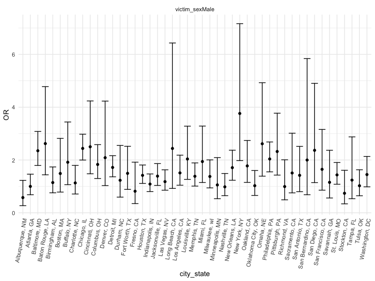
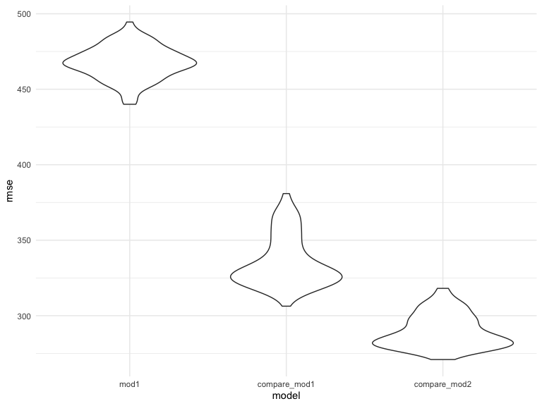

p8105_hw6_jy3186
================
Jiayi Yang
2022-11-26

``` r
library(tidyverse)
```

    ## ── Attaching packages ─────────────────────────────────────── tidyverse 1.3.2 ──
    ## ✔ ggplot2 3.4.0      ✔ purrr   0.3.5 
    ## ✔ tibble  3.1.8      ✔ dplyr   1.0.10
    ## ✔ tidyr   1.2.0      ✔ stringr 1.4.1 
    ## ✔ readr   2.1.2      ✔ forcats 0.5.2 
    ## ── Conflicts ────────────────────────────────────────── tidyverse_conflicts() ──
    ## ✖ dplyr::filter() masks stats::filter()
    ## ✖ dplyr::lag()    masks stats::lag()

``` r
library(dplyr)
library(readr)
library(modelr)
```

# Problem 1

# Problem 2

Import and tidy the dataset

``` r
homicide_df = 
  read_csv(url("https://github.com/washingtonpost/data-homicides/blob/master/homicide-data.csv?raw=true"))
```

Create a city_state variable (e.g. “Baltimore, MD”), and a binary
variable of whether homicide is solved. `solve_status` is 1 when remains
unsolved, is 0 when it’s solved.

``` r
homicide_new =
homicide_df %>% 
  mutate(city_state = str_c(city, state, sep = ", ")) %>% 
  group_by(city_state)

cleaned_df =
  homicide_new %>% 
   mutate(
    solve_status = ifelse(disposition %in% c("Closed without arrest", "Open/No arrest"),1,0),
    victim_age = as.numeric(victim_age)
  ) %>% 
  drop_na() %>% 
  filter( 
          victim_race %in% c("White", "Black"),
         !city_state %in% c("Dallas, TX", "Phoenix, AZ", "Kansas City, MO", "Tulsa, AL")) 

cleaned_df
```

    ## # A tibble: 39,361 × 14
    ## # Groups:   city_state [47]
    ##    uid   repor…¹ victi…² victi…³ victi…⁴ victi…⁵ victi…⁶ city  state   lat   lon
    ##    <chr>   <dbl> <chr>   <chr>   <chr>     <dbl> <chr>   <chr> <chr> <dbl> <dbl>
    ##  1 Alb-…  2.01e7 SATTER… VIVIANA White        15 Female  Albu… NM     35.1 -107.
    ##  2 Alb-…  2.01e7 MULA    VIVIAN  White        72 Female  Albu… NM     35.1 -107.
    ##  3 Alb-…  2.01e7 BOOK    GERALD… White        91 Female  Albu… NM     35.2 -107.
    ##  4 Alb-…  2.01e7 MARTIN… GUSTAVO White        56 Male    Albu… NM     35.1 -107.
    ##  5 Alb-…  2.01e7 GRAY    STEFAN… White        43 Female  Albu… NM     35.1 -107.
    ##  6 Alb-…  2.01e7 BRITO   ELIZAB… White        22 Female  Albu… NM     35.1 -107.
    ##  7 Alb-…  2.01e7 KING    TEVION  Black        15 Male    Albu… NM     35.1 -107.
    ##  8 Alb-…  2.01e7 BOYKIN  CEDRIC  Black        25 Male    Albu… NM     35.1 -107.
    ##  9 Alb-…  2.01e7 BARRAG… MIGUEL  White        20 Male    Albu… NM     35.1 -107.
    ## 10 Alb-…  2.01e7 WRONSKI VIOLA   White        88 Female  Albu… NM     35.1 -107.
    ## # … with 39,351 more rows, 3 more variables: disposition <chr>,
    ## #   city_state <chr>, solve_status <dbl>, and abbreviated variable names
    ## #   ¹​reported_date, ²​victim_last, ³​victim_first, ⁴​victim_race, ⁵​victim_age,
    ## #   ⁶​victim_sex

For the city of Baltimore, MD, use the glm function to fit a logistic
regression with resolved vs unresolved as the outcome and victim age,
sex and race as predictors.

Now run glm for each of the cities in your dataset, and extract the
adjusted odds ratio (and CI) for solving homicides comparing male
victims to female victims.

``` r
fit_glm = 
  cleaned_df %>% 
  nest(data = -city_state) %>% 
  mutate(
    model = map(data, ~glm(solve_status ~ victim_age + victim_race + victim_sex, data = .x, family = binomial())),
     results = map(model, broom::tidy))%>%
  select(city_state, results) %>% 
  unnest(results) %>% 
  mutate(OR = exp(estimate),
         CI_lower = exp(estimate -1.96*std.error),
         CI_higher = exp(estimate +1.96*std.error)
         ) %>%
  filter(term == c("victim_sexMale")) %>% 
  select(city_state, term, OR, CI_lower, CI_higher) 
fit_glm
```

    ## # A tibble: 47 × 5
    ## # Groups:   city_state [47]
    ##    city_state      term              OR CI_lower CI_higher
    ##    <chr>           <chr>          <dbl>    <dbl>     <dbl>
    ##  1 Albuquerque, NM victim_sexMale 0.577    0.271      1.23
    ##  2 Atlanta, GA     victim_sexMale 1.00     0.683      1.46
    ##  3 Baltimore, MD   victim_sexMale 2.35     1.79       3.08
    ##  4 Baton Rouge, LA victim_sexMale 2.62     1.44       4.78
    ##  5 Birmingham, AL  victim_sexMale 1.15     0.756      1.74
    ##  6 Boston, MA      victim_sexMale 1.49     0.786      2.82
    ##  7 Buffalo, NY     victim_sexMale 1.91     1.07       3.44
    ##  8 Charlotte, NC   victim_sexMale 1.13     0.713      1.80
    ##  9 Chicago, IL     victim_sexMale 2.44     2.00       2.98
    ## 10 Cincinnati, OH  victim_sexMale 2.50     1.48       4.24
    ## # … with 37 more rows

Create a plot that shows the estimated ORs and CIs for each city.
Organize cities according to estimated OR, and comment on the plot.

``` r
fit_glm %>% 
  ggplot(aes(x = city_state, y = OR)) +
  geom_point() + 
  geom_errorbar(aes(ymin = CI_lower, ymax = CI_higher)) +
  facet_wrap(~term) + 
  theme(axis.text.x = element_text(angle = 80, hjust = 1))
```



## Problem 3

load and tidy data

``` r
birthweight <- read_csv("birthweight.csv")
```

    ## Rows: 4342 Columns: 20
    ## ── Column specification ────────────────────────────────────────────────────────
    ## Delimiter: ","
    ## dbl (20): babysex, bhead, blength, bwt, delwt, fincome, frace, gaweeks, malf...
    ## 
    ## ℹ Use `spec()` to retrieve the full column specification for this data.
    ## ℹ Specify the column types or set `show_col_types = FALSE` to quiet this message.

``` r
birthweight %>% 
  select(bwt, blength, gaweeks, bhead, babysex) %>% 
  drop_na() %>% 
  mutate(
    babysex = case_when(babysex == 1 ~ "Male",
              babysex == 2 ~ "Female") %>% 
      as.factor()
  )
```

    ## # A tibble: 4,342 × 5
    ##      bwt blength gaweeks bhead babysex
    ##    <dbl>   <dbl>   <dbl> <dbl> <fct>  
    ##  1  3629      51    39.9    34 Female 
    ##  2  3062      48    25.9    34 Male   
    ##  3  3345      50    39.9    36 Female 
    ##  4  3062      52    40      34 Male   
    ##  5  3374      52    41.6    34 Female 
    ##  6  3374      52    40.7    33 Male   
    ##  7  2523      46    40.3    33 Female 
    ##  8  2778      49    37.4    33 Female 
    ##  9  3515      52    40.3    36 Male   
    ## 10  3459      50    40.7    33 Male   
    ## # … with 4,332 more rows

regression analysis, made a model

``` r
model = lm(bwt~gaweeks, data = birthweight)
model
```

    ## 
    ## Call:
    ## lm(formula = bwt ~ gaweeks, data = birthweight)
    ## 
    ## Coefficients:
    ## (Intercept)      gaweeks  
    ##      476.00        66.92

show a plot of model residuals against fitted values – use
add_predictions and add_residuals in making this plot.

``` r
resid_plot =
birthweight %>% 
  modelr::add_residuals(model) %>% 
  ggplot(aes(x = gasweeks, y = resid)) + geom_violin()

predict_plot = 
  birthweight %>% 
  modelr::add_predictions(model) %>% 
  ggplot(aes(x = gasweeks, y = resid)) + geom_violin()
```

Compare your model to two others:

One using length at birth and gestational age as predictors (main
effects only) One using head circumference, length, sex, and all
interactions (including the three-way interaction) between these

``` r
model1 = lm(bwt~blength + gaweeks, data = birthweight)
model2 = lm(bwt~bhead*blength*babysex, data = birthweight)
```

Make this comparison in terms of the cross-validated prediction error;
use crossv_mc and functions in purrr as appropriate.

``` r
cv_df = 
  crossv_mc(birthweight, 100) 
```

``` r
cv_df =
   cv_df %>% 
  mutate(
    train = map(train, as_tibble),
    test = map(test, as_tibble)
  ) %>% 
  mutate(
    mod1 = map(train, ~lm(bwt~gaweeks, data = .x)),
    compare_mod1 = map(train, ~lm(bwt~blength +gaweeks, data = .x)),
    compare_mod2 = map(train, ~lm(bwt~bhead*blength*babysex, data = .x)) 
  ) %>% 
  mutate(
    rmse_mod1 = map2_dbl(mod1, test, ~rmse(model = .x, data = .y)),
    rmse_compare_mod1 = map2_dbl(compare_mod1, test, ~rmse(model = .x, data = .y)),
    rmse_compare_mod2 = map2_dbl(compare_mod2, test, ~rmse(model = .x, data = .y))
  )
```

``` r
cv_df %>% 
  select(starts_with("rmse")) %>% 
  pivot_longer(
    everything(),
    names_to = "model", 
    values_to = "rmse",
    names_prefix = "rmse_") %>% 
  mutate(model = fct_inorder(model)) %>% 
  ggplot(aes(x = model, y = rmse)) + geom_violin()
```



I will decide to use the third model(compare_mod2) with head
circumference, length, sex, and all interactions (including the
three-way interaction), because it has the least rmse which is the most
reflective in representing the relationship between birthweight and
these predictors.
