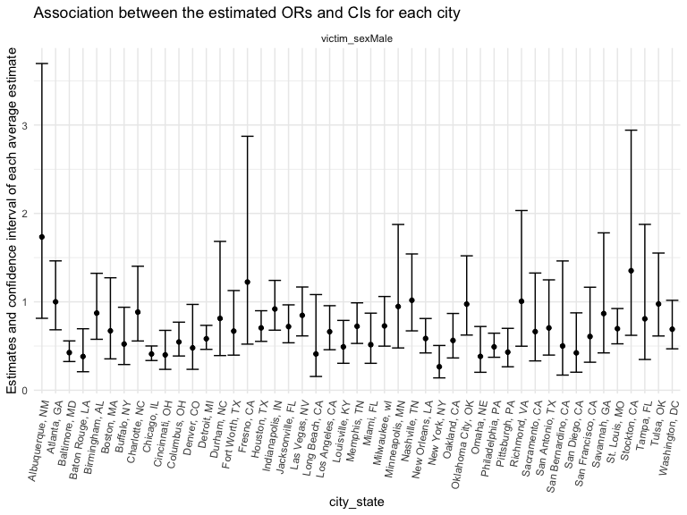
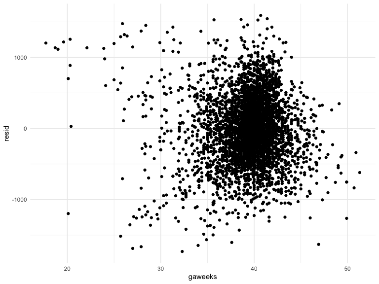
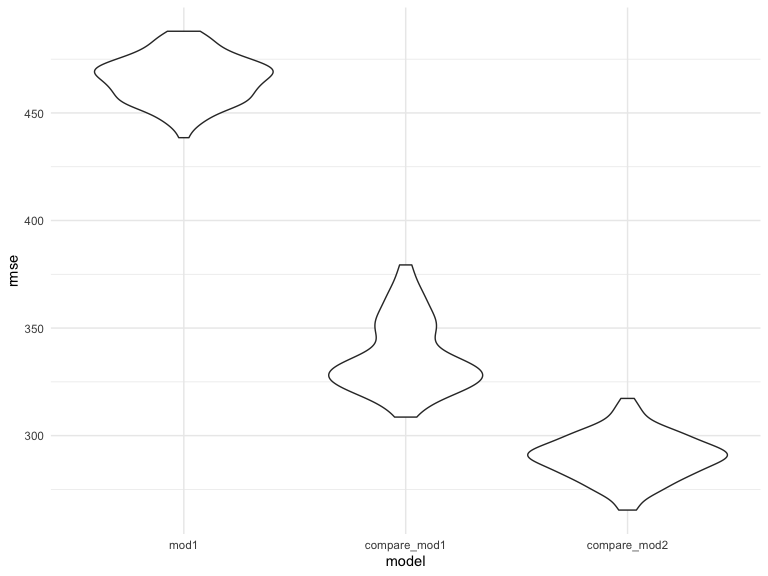

p8105_hw6_jy3186
================
Jiayi Yang
2022-11-26

``` r
library(tidyverse)
```

    ## ── Attaching packages ─────────────────────────────────────── tidyverse 1.3.2 ──
    ## ✔ ggplot2 3.4.0      ✔ purrr   0.3.5 
    ## ✔ tibble  3.1.8      ✔ dplyr   1.0.10
    ## ✔ tidyr   1.2.0      ✔ stringr 1.4.1 
    ## ✔ readr   2.1.2      ✔ forcats 0.5.2 
    ## ── Conflicts ────────────────────────────────────────── tidyverse_conflicts() ──
    ## ✖ dplyr::filter() masks stats::filter()
    ## ✖ dplyr::lag()    masks stats::lag()

``` r
library(dplyr)
library(readr)
library(modelr)
library(ggridges)
```

# Problem 1

# Problem 2

Import and tidy the dataset

``` r
homicide_df = 
  read_csv(url("https://github.com/washingtonpost/data-homicides/blob/master/homicide-data.csv?raw=true"))
```

Create a city_state variable (e.g. “Baltimore, MD”), and a binary
variable of whether homicide is solved. `solve_status` is 1 when remains
unsolved, is 0 when it’s solved.

``` r
homicide_new =
homicide_df %>% 
  mutate(city_state = str_c(city, state, sep = ", ")) %>% 
  group_by(city_state)

cleaned_df =
  homicide_new %>% 
   mutate(
    solve_status = ifelse(disposition %in% c("Closed without arrest", "Open/No arrest"),0,1),
    victim_age = as.numeric(victim_age)
  ) %>% 
  drop_na() %>% 
  filter( 
          victim_race %in% c("White", "Black"),
         !city_state %in% c("Dallas, TX", "Phoenix, AZ", "Kansas City, MO", "Tulsa, AL")) 

cleaned_df
```

    ## # A tibble: 39,361 × 14
    ## # Groups:   city_state [47]
    ##    uid   repor…¹ victi…² victi…³ victi…⁴ victi…⁵ victi…⁶ city  state   lat   lon
    ##    <chr>   <dbl> <chr>   <chr>   <chr>     <dbl> <chr>   <chr> <chr> <dbl> <dbl>
    ##  1 Alb-…  2.01e7 SATTER… VIVIANA White        15 Female  Albu… NM     35.1 -107.
    ##  2 Alb-…  2.01e7 MULA    VIVIAN  White        72 Female  Albu… NM     35.1 -107.
    ##  3 Alb-…  2.01e7 BOOK    GERALD… White        91 Female  Albu… NM     35.2 -107.
    ##  4 Alb-…  2.01e7 MARTIN… GUSTAVO White        56 Male    Albu… NM     35.1 -107.
    ##  5 Alb-…  2.01e7 GRAY    STEFAN… White        43 Female  Albu… NM     35.1 -107.
    ##  6 Alb-…  2.01e7 BRITO   ELIZAB… White        22 Female  Albu… NM     35.1 -107.
    ##  7 Alb-…  2.01e7 KING    TEVION  Black        15 Male    Albu… NM     35.1 -107.
    ##  8 Alb-…  2.01e7 BOYKIN  CEDRIC  Black        25 Male    Albu… NM     35.1 -107.
    ##  9 Alb-…  2.01e7 BARRAG… MIGUEL  White        20 Male    Albu… NM     35.1 -107.
    ## 10 Alb-…  2.01e7 WRONSKI VIOLA   White        88 Female  Albu… NM     35.1 -107.
    ## # … with 39,351 more rows, 3 more variables: disposition <chr>,
    ## #   city_state <chr>, solve_status <dbl>, and abbreviated variable names
    ## #   ¹​reported_date, ²​victim_last, ³​victim_first, ⁴​victim_race, ⁵​victim_age,
    ## #   ⁶​victim_sex

For the city of Baltimore, MD, use the glm function to fit a logistic
regression with resolved vs unresolved as the outcome and victim age,
sex and race as predictors.

``` r
Baltimore_df = 
  cleaned_df %>% 
  filter(city_state == "Baltimore, MD") %>% 
  mutate(
    victim_race = fct_relevel(victim_race, "White")
  ) %>% 
  select(solve_status, victim_age, victim_sex, victim_race)
```

    ## Adding missing grouping variables: `city_state`

``` r
fit_glm = 
  Baltimore_df %>% 
  glm(solve_status ~ victim_age + victim_race + victim_sex, data = ., family = binomial()) %>% 
  broom::tidy() %>% 
  mutate(OR = exp(estimate),
         CI_lower = exp(estimate -1.96*std.error),
         CI_higher = exp(estimate +1.96*std.error)
         ) %>% 
  select(-std.error, -statistic)
fit_glm
```

    ## # A tibble: 4 × 6
    ##   term             estimate  p.value    OR CI_lower CI_higher
    ##   <chr>               <dbl>    <dbl> <dbl>    <dbl>     <dbl>
    ## 1 (Intercept)       1.15    1.14e- 6 3.16     1.99      5.03 
    ## 2 victim_age       -0.00673 4.30e- 2 0.993    0.987     1.00 
    ## 3 victim_raceBlack -0.842   1.45e- 6 0.431    0.306     0.607
    ## 4 victim_sexMale   -0.854   6.26e-10 0.426    0.325     0.558

For solving homicides comparing male victims to female victims keeping
all other variables fixed, the adjusted OR is 3.16 with a CI (1.99,
5.03).

Now run glm for each of the cities in your dataset, and extract the
adjusted odds ratio (and CI) for solving homicides comparing male
victims to female victims.

``` r
fit_glm = 
  cleaned_df %>% 
  nest(data = -city_state) %>% 
  mutate(
    model = map(data, ~glm(solve_status ~ victim_age + victim_race + victim_sex, data = .x, family = binomial())),
     results = map(model, broom::tidy))%>%
  select(city_state, results) %>% 
  unnest(results) %>% 
  mutate(OR = exp(estimate),
         CI_lower = exp(estimate -1.96*std.error),
         CI_higher = exp(estimate +1.96*std.error)
         ) %>%
  filter(term == c("victim_sexMale")) %>% 
  select(city_state, term, OR, CI_lower, CI_higher) 
fit_glm
```

    ## # A tibble: 47 × 5
    ## # Groups:   city_state [47]
    ##    city_state      term              OR CI_lower CI_higher
    ##    <chr>           <chr>          <dbl>    <dbl>     <dbl>
    ##  1 Albuquerque, NM victim_sexMale 1.73     0.814     3.70 
    ##  2 Atlanta, GA     victim_sexMale 1.00     0.684     1.46 
    ##  3 Baltimore, MD   victim_sexMale 0.426    0.325     0.558
    ##  4 Baton Rouge, LA victim_sexMale 0.381    0.209     0.695
    ##  5 Birmingham, AL  victim_sexMale 0.873    0.576     1.32 
    ##  6 Boston, MA      victim_sexMale 0.672    0.355     1.27 
    ##  7 Buffalo, NY     victim_sexMale 0.522    0.291     0.939
    ##  8 Charlotte, NC   victim_sexMale 0.884    0.557     1.40 
    ##  9 Chicago, IL     victim_sexMale 0.410    0.336     0.501
    ## 10 Cincinnati, OH  victim_sexMale 0.400    0.236     0.677
    ## # … with 37 more rows

Create a plot that shows the estimated ORs and CIs for each city.
Organize cities according to estimated OR, and comment on the plot.

``` r
fit_glm %>% 

  ggplot(aes(x = city_state, y = OR)) +
  geom_point() + 
  geom_errorbar(aes(ymin = CI_lower, ymax = CI_higher)) +
  facet_wrap(~term) + 
  theme(axis.text.x = element_text(angle = 80, hjust = 1)) +
  labs(
    title = "Association between the estimated ORs and CIs for each city",
    x = "city_state",
    y = "Estimates and confidence interval of each average estimate"
  )
```



## Problem 3

load and tidy data

``` r
birthweight <- read_csv("birthweight.csv")
```

    ## Rows: 4342 Columns: 20
    ## ── Column specification ────────────────────────────────────────────────────────
    ## Delimiter: ","
    ## dbl (20): babysex, bhead, blength, bwt, delwt, fincome, frace, gaweeks, malf...
    ## 
    ## ℹ Use `spec()` to retrieve the full column specification for this data.
    ## ℹ Specify the column types or set `show_col_types = FALSE` to quiet this message.

``` r
birthweight %>% 
  select(bwt, blength, gaweeks, bhead, babysex) %>% 
  drop_na() %>% 
  mutate(
    babysex = case_when(babysex == 1 ~ "Male",
              babysex == 2 ~ "Female") %>% 
      as.factor()
  )
```

    ## # A tibble: 4,342 × 5
    ##      bwt blength gaweeks bhead babysex
    ##    <dbl>   <dbl>   <dbl> <dbl> <fct>  
    ##  1  3629      51    39.9    34 Female 
    ##  2  3062      48    25.9    34 Male   
    ##  3  3345      50    39.9    36 Female 
    ##  4  3062      52    40      34 Male   
    ##  5  3374      52    41.6    34 Female 
    ##  6  3374      52    40.7    33 Male   
    ##  7  2523      46    40.3    33 Female 
    ##  8  2778      49    37.4    33 Female 
    ##  9  3515      52    40.3    36 Male   
    ## 10  3459      50    40.7    33 Male   
    ## # … with 4,332 more rows

``` r
skimr::skim(birthweight)
```

|                                                  |             |
|:-------------------------------------------------|:------------|
| Name                                             | birthweight |
| Number of rows                                   | 4342        |
| Number of columns                                | 20          |
| \_\_\_\_\_\_\_\_\_\_\_\_\_\_\_\_\_\_\_\_\_\_\_   |             |
| Column type frequency:                           |             |
| numeric                                          | 20          |
| \_\_\_\_\_\_\_\_\_\_\_\_\_\_\_\_\_\_\_\_\_\_\_\_ |             |
| Group variables                                  | None        |

Data summary

**Variable type: numeric**

| skim_variable | n_missing | complete_rate |    mean |     sd |     p0 |     p25 |     p50 |     p75 |   p100 | hist  |
|:--------------|----------:|--------------:|--------:|-------:|-------:|--------:|--------:|--------:|-------:|:------|
| babysex       |         0 |             1 |    1.49 |   0.50 |   1.00 |    1.00 |    1.00 |    2.00 |    2.0 | ▇▁▁▁▇ |
| bhead         |         0 |             1 |   33.65 |   1.62 |  21.00 |   33.00 |   34.00 |   35.00 |   41.0 | ▁▁▆▇▁ |
| blength       |         0 |             1 |   49.75 |   2.72 |  20.00 |   48.00 |   50.00 |   51.00 |   63.0 | ▁▁▁▇▁ |
| bwt           |         0 |             1 | 3114.40 | 512.15 | 595.00 | 2807.00 | 3132.50 | 3459.00 | 4791.0 | ▁▁▇▇▁ |
| delwt         |         0 |             1 |  145.57 |  22.21 |  86.00 |  131.00 |  143.00 |  157.00 |  334.0 | ▅▇▁▁▁ |
| fincome       |         0 |             1 |   44.11 |  25.98 |   0.00 |   25.00 |   35.00 |   65.00 |   96.0 | ▃▇▅▂▃ |
| frace         |         0 |             1 |    1.66 |   0.85 |   1.00 |    1.00 |    2.00 |    2.00 |    8.0 | ▇▁▁▁▁ |
| gaweeks       |         0 |             1 |   39.43 |   3.15 |  17.70 |   38.30 |   39.90 |   41.10 |   51.3 | ▁▁▂▇▁ |
| malform       |         0 |             1 |    0.00 |   0.06 |   0.00 |    0.00 |    0.00 |    0.00 |    1.0 | ▇▁▁▁▁ |
| menarche      |         0 |             1 |   12.51 |   1.48 |   0.00 |   12.00 |   12.00 |   13.00 |   19.0 | ▁▁▂▇▁ |
| mheight       |         0 |             1 |   63.49 |   2.66 |  48.00 |   62.00 |   63.00 |   65.00 |   77.0 | ▁▁▇▂▁ |
| momage        |         0 |             1 |   20.30 |   3.88 |  12.00 |   18.00 |   20.00 |   22.00 |   44.0 | ▅▇▂▁▁ |
| mrace         |         0 |             1 |    1.63 |   0.77 |   1.00 |    1.00 |    2.00 |    2.00 |    4.0 | ▇▇▁▁▁ |
| parity        |         0 |             1 |    0.00 |   0.10 |   0.00 |    0.00 |    0.00 |    0.00 |    6.0 | ▇▁▁▁▁ |
| pnumlbw       |         0 |             1 |    0.00 |   0.00 |   0.00 |    0.00 |    0.00 |    0.00 |    0.0 | ▁▁▇▁▁ |
| pnumsga       |         0 |             1 |    0.00 |   0.00 |   0.00 |    0.00 |    0.00 |    0.00 |    0.0 | ▁▁▇▁▁ |
| ppbmi         |         0 |             1 |   21.57 |   3.18 |  13.07 |   19.53 |   21.03 |   22.91 |   46.1 | ▃▇▁▁▁ |
| ppwt          |         0 |             1 |  123.49 |  20.16 |  70.00 |  110.00 |  120.00 |  134.00 |  287.0 | ▅▇▁▁▁ |
| smoken        |         0 |             1 |    4.15 |   7.41 |   0.00 |    0.00 |    0.00 |    5.00 |   60.0 | ▇▁▁▁▁ |
| wtgain        |         0 |             1 |   22.08 |  10.94 | -46.00 |   15.00 |   22.00 |   28.00 |   89.0 | ▁▁▇▁▁ |

There is no missing data. regression analysis, made a model

``` r
model = lm(bwt~gaweeks, data = birthweight)
model
```

    ## 
    ## Call:
    ## lm(formula = bwt ~ gaweeks, data = birthweight)
    ## 
    ## Coefficients:
    ## (Intercept)      gaweeks  
    ##      476.00        66.92

show a plot of model residuals against fitted values – use
add_predictions and add_residuals in making this plot.

``` r
resid_plot =
birthweight %>% 
  modelr::add_residuals(model) %>% 
  ggplot(aes(x = gaweeks, y = resid)) + geom_point()

predict_plot = 
  birthweight %>% 
  modelr::add_predictions(model) %>% 
  ggplot(aes(x = gaweeks, y = resid)) + geom_point()

resid_plot
```



Compare your model to two others:

One using length at birth and gestational age as predictors (main
effects only) One using head circumference, length, sex, and all
interactions (including the three-way interaction) between these

``` r
model1 = lm(bwt~blength + gaweeks, data = birthweight)
model2 = lm(bwt~bhead*blength*babysex, data = birthweight)
```

Make this comparison in terms of the cross-validated prediction error;
use crossv_mc and functions in purrr as appropriate.

``` r
cv_df = 
  crossv_mc(birthweight, 100) 
```

``` r
cv_df =
   cv_df %>% 
  mutate(
    train = map(train, as_tibble),
    test = map(test, as_tibble)
  ) %>% 
  mutate(
    mod1 = map(train, ~lm(bwt~gaweeks, data = .x)),
    compare_mod1 = map(train, ~lm(bwt~blength +gaweeks, data = .x)),
    compare_mod2 = map(train, ~lm(bwt~bhead*blength*babysex, data = .x)) 
  ) %>% 
  mutate(
    rmse_mod1 = map2_dbl(mod1, test, ~rmse(model = .x, data = .y)),
    rmse_compare_mod1 = map2_dbl(compare_mod1, test, ~rmse(model = .x, data = .y)),
    rmse_compare_mod2 = map2_dbl(compare_mod2, test, ~rmse(model = .x, data = .y))
  )
```

``` r
cv_df %>% 
  select(starts_with("rmse")) %>% 
  pivot_longer(
    everything(),
    names_to = "model", 
    values_to = "rmse",
    names_prefix = "rmse_") %>% 
  mutate(model = fct_inorder(model)) %>% 
  ggplot(aes(x = model, y = rmse)) + geom_violin()
```



I will decide to use the third model(compare_mod2) with head
circumference, length, sex, and all interactions (including the
three-way interaction), because it has the least rmse which is the most
reflective in representing the relationship between birthweight and
these predictors.
